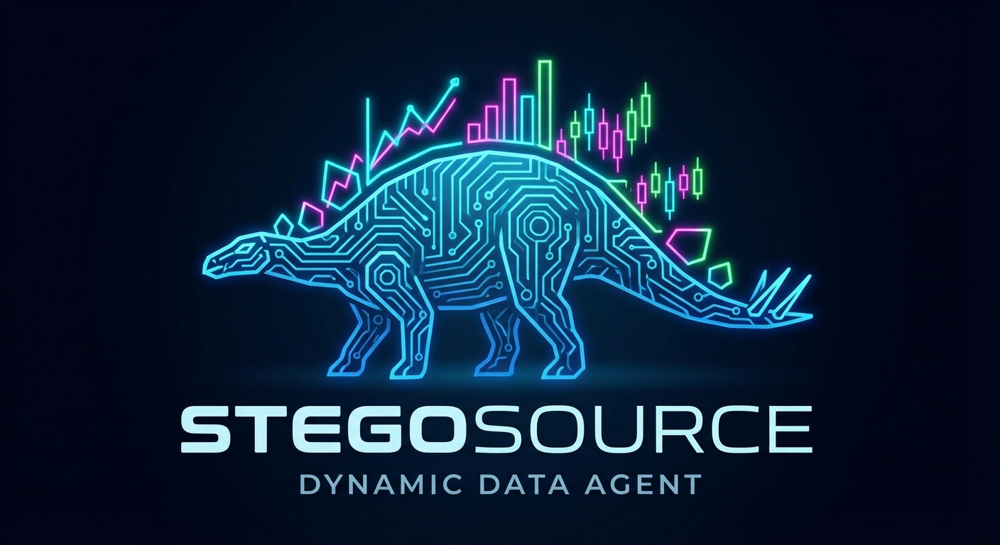

<p align="center">
  
</p>

# Stegosource

**Dynamic Data Visualization Agent with Self-Modifying UI**

Stegosource is a conversational data exploration tool powered by the Anthropic Agent SDK and Streamlit. It fetches financial market data, generates interactive visualizations, and dynamically modifies its own UI based on natural language requests -- all in real-time.

Built as a showcase for Claude Code agent teams running in a GitHub Codespace with dangerous mode enabled.

## Why "Stegosource"?

- **Stego** = Stegosaurus -- adaptive plates that changed blood flow, just like our adaptive UI
- **Source** = Data source + open source -- an authoritative data origin that adapts to your needs

## Tech Stack

| Layer | Technology |
|-------|-----------|
| UI Framework | Python + Streamlit (hot-reload) |
| Agent Orchestration | Anthropic Agent SDK |
| Market Data | Alpha Vantage API |
| Persistence | SQLite via MCP server |
| Visualization | Plotly |

## Use Cases

### Conversational Data Exploration
Ask for stock data in natural language and get interactive charts instantly.

> "Show me Tesla stock price for the last 3 months"

### Dynamic UI Controls
Request new form controls and the agent generates them on the fly.

> "Let me adjust the date range"

### Chart Type Morphing
Switch between visualization types through conversation.

> "Switch to candlestick chart"

### Data Input & Persistence
Create forms that submit data to the database, accessible by the agent via MCP.

> "Let me set a price alert for TSLA at $250"

### Database-Driven Visualizations
Overlay persisted user data onto charts -- the full form-to-DB-to-visualization loop.

> "Show my alerts as annotations on the chart"

### Multi-Metric Dashboards
Compare multiple symbols with dynamically generated controls.

> "Compare AAPL, MSFT, and GOOGL"

## Architecture

```
Streamlit App (app.py - hot-reloads on file changes)
    |
Anthropic Agent SDK (agent orchestrator)
    |
Tools:
  - Alpha Vantage API client (fetch stock/crypto data)
  - MCP SQLite server (persist user data)
  - Code execution (generate/test visualizations)
  - File writing (update app.py dynamically)
```

## Project Structure

```
stegosource/
├── app.py                 # Streamlit app (modified dynamically by agent)
├── agent.py               # Anthropic SDK agent orchestrator
├── tools/
│   ├── alpha_vantage.py   # API client
│   ├── mcp_sqlite.py      # Database MCP interface
│   └── viz_generator.py   # Visualization code templates
├── data/
│   └── stegosource.db     # SQLite database
├── requirements.txt
└── README.md
```

## Development Setup

This project is designed to run in a GitHub Codespace with Claude Code in dangerous mode:

```bash
# SSH into codespace from your laptop
gh codespace ssh -c <codespace-name>

# Start a tmux session
tmux new -s stegosource

# Launch Claude Code in dangerous mode (allows autonomous file edits and command execution)
claude --dangerously-skip-permissions

# Run Streamlit with hot-reload (in a separate tmux pane: Ctrl+B then %)
streamlit run app.py --server.runOnSave=true
```

### Accessing the App

Port 8501 is automatically forwarded by the codespace. After starting Streamlit:

- **VS Code in browser**: A notification will appear to open the app, or go to the **Ports** tab and click the forwarded URL for port 8501
- **SSH**: Run `gh codespace ports forward 8501:8501 -c <codespace-name>` in a local terminal, then open http://localhost:8501

## License

MIT
